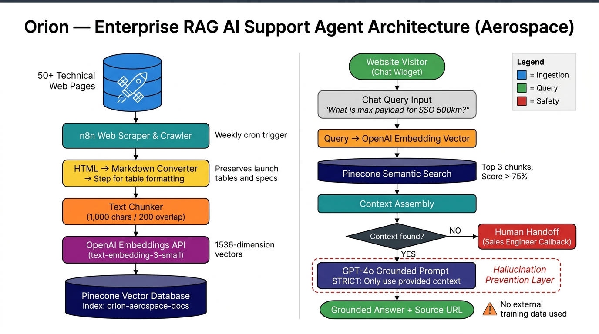
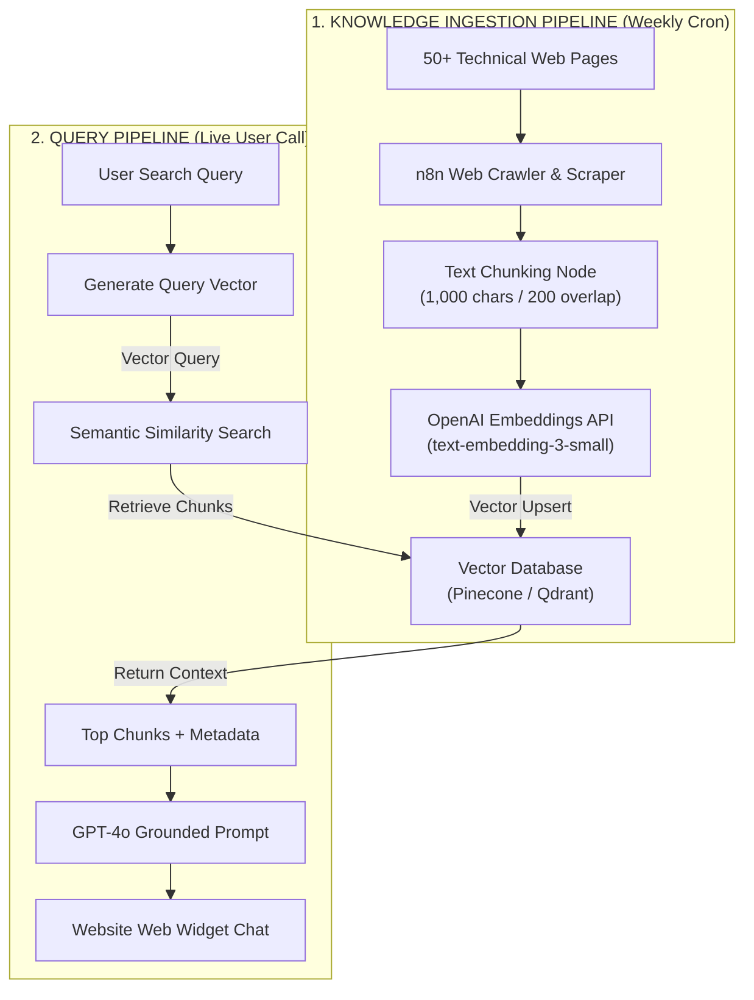

# 📈 Enterprise Case Study: Orion — Multi-Page RAG AI Support Agent for Aerospace Launch Services

> **Client**: Confidential (Aerospace & Space Launch Provider, Germany)  
> **Role**: Lead Conversational AI & Search Architect  
> **Ecosystem**: n8n, OpenAI (GPT-4o & Embeddings), Vector DB (Pinecone/Qdrant), Web Scraping Engine, Custom Web Chat Widget  


> **Industry**: Aerospace / Enterprise AI &nbsp;|&nbsp; **Platform**: n8n + Pinecone &nbsp;|&nbsp; **Pattern**: RAG with Hallucination Prevention

---

## 1. Project Overview

* **Project Name**: Orion - Enterprise Retrieval-Augmented Generation (RAG) AI Customer Support Agent
* **Industry**: Aerospace, Space Launch, & Advanced Engineering
* **Client Type**: Private Rocket Launch & Aerospace Manufacturing Company (Germany)
* **Project Executive Summary**:
  Designed and engineered **Orion**, a production-grade Retrieval-Augmented Generation (RAG) AI Support Agent integrated into the corporate website of a German aerospace launch provider. The agent indexes over 50 pages of complex technical documentation, launch parameters, pricing frameworks, and service-level agreements.
  
  Using **n8n** to coordinate the ingestion pipeline and semantic queries, **OpenAI Embeddings** to build the index, and a **Vector Database** for retrieval, Orion provides grounded, hallucination-free answers to technical customer inquiries.

---

## 2. Client Background

* **Business Model**: Commercial satellite launch broker and rocket launch systems manufacturer.
* **Operating Profile**: High-integrity B2B customer inquiries spanning space launch schedules, payload capacity specifications, safety protocols, launch site logistics, and European space export regulations.
* **Legacy State**: Technical sales staff spent hours answering repetitive pre-sales questions about payload dimensions, orbital options, and compliance documents, diverting time from mission engineering.

---

## 3. Problem Statement

Automating support in a highly regulated, safety-critical industry like aerospace presented several challenges:

1. **Safety-Critical Hallucinations**: Standard LLMs hallucinate technical specifications, which can lead to compliance violations or severe reputational damage.
2. **Dense, Fragmented Knowledge Base**: Launch service data was spread across 50+ dense web pages, technical PDF brochures, payload guides, and export control regulations.
3. **Complex Technical Queries**: Customers asked complex questions (e.g. *"What is the max payload volume for a Sun-synchronous orbit of 500km?"*) requiring precise data extraction.
4. **Context Window Limits**: Passing all 50+ pages of documentation into the prompt on every query was cost-prohibitive and exceeded context window limits.

---

## 4. Goals & Requirements

* **Zero-Hallucination Guardrails**: Ensure all responses are strictly grounded in Nerva/Orion's uploaded launch documentation.
* **Multi-Page Knowledge Ingestion**: Extract, chunk, embed, and index 50+ web pages and documents automatically.
* **Low-Latency Semantic Retrieval**: Query the vector database and return context in under 1.5 seconds.
* **Direct Web Widget Integration**: Deploy a clean UI chat widget on the corporate website.
* **Human Handoff Trigger**: Automatically flag complex compliance or custom pricing inquiries for manual follow-up.

---

## 5. Solution Architecture

The RAG platform uses n8n to coordinate the data ingestion and retrieval workflows, connecting web crawlers, embedding models, vector databases, and OpenAI LLMs.

### 🗺️ Visual Architecture Diagram



*Figure 1: Dual-pipeline RAG architecture — weekly ingestion (left) indexes 50+ technical pages into Pinecone, while the live query pipeline (right) retrieves semantically relevant chunks and generates grounded GPT-4o responses.*

---

### 📐 Pipeline Diagrams

#### 1. Ingestion Pipeline
```
[ 50+ Technical Web Pages ] ──► [ n8n Crawler & Parser ] ──► [ OpenAI Text Embeddings ] ──► [ Vector Database ]
```

#### 2. Query Pipeline
```
[ User Query ] ──► [ n8n Workflow ] ──► [ Semantic Search ] ──► [ Retrieve Top Chunks ] ──► [ GPT-4o LLM ] ──► [ User Response ]
```

---

## 6. Tech Stack

* **Workflow Orchestration**: n8n Workflow Automation Engine.
* **AI Engine**: OpenAI API (GPT-4o for conversational synthesis, `text-embedding-3-small` for semantic indexing).
* **Vector Database**: Pinecone / Qdrant (storing dense vector coordinates).
* **Ingestion Middleware**: Cheerio (for web page parsing) and JS-based text chunkers.
* **UI Delivery**: Custom CSS/JS Web Chat Widget integrated into the client's CMS.

---

## 7. Workflow Breakdown

### 1. Ingestion Pipeline
* **Trigger**: Scheduled weekly cron or manual upload trigger.
* **Web Scraping**: n8n web scraper crawls the list of 50+ target URLs, extracting clean text content while removing navigation, footers, and HTML wrappers.
* **Text Chunking**: A JavaScript node splits long documents into 1,000-character chunks with a 200-character overlap to preserve context across boundaries.
* **Vector Embeddings**: Sends text chunks to OpenAI's embeddings API, generating 1536-dimension vectors.
* **Database Upsert**: Stores the vectors along with metadata (source URL, title, chunk ID) in the Vector Database.

### 2. Live Query Retrieval
* **Trigger**: A user submits a query through the website chat widget.
* **Query Embedding**: n8n converts the query into a vector representation.
* **Semantic Search**: Queries the Vector Database to retrieve the top 3 most relevant context chunks.
* **Prompt Assembly**: Constructs a prompt containing the retrieved context and strict guidelines: *"Answer the query using ONLY the provided context. If the answer cannot be found, state that you do not have that information."*
* **Conversational Synthesis**: GPT-4o generates a grounded answer and appends source page links for verification.

---

## 8. AI & Agent Architecture (RAG Detail)



---

## 9. Challenges Faced & Solutions Implemented

### Challenge 1: Hallucinations on Space Regulations
* **Problem**: Early testing showed the LLM using its public training data to answer space-law compliance questions, causing inaccuracies.
* **Solution**: Implemented a system prompt with strict guardrails: *"You are an AI assistant grounded ONLY in Orion's launch database. If the context does not contain the answer, say: 'I cannot verify that from the documentation. Let me coordinate a callback with our launch engineering team.' Do not use external knowledge."*

### Challenge 2: Parsing Complex Launch Tables
* **Problem**: Web scrapers extracted launch tables as a wall of unreadable numbers, breaking the semantic search.
* **Solution**: Developed a parsing script to convert HTML tables into clean Markdown format before chunking, preserving row and column relationships.

### Challenge 3: Inefficient Context Retrieval
* **Problem**: Queries returning unrelated context chunks resulted in disjointed or incorrect answers.
* **Solution**: Tuned chunk sizes (1,000 characters) and overlap (200 characters), and implemented a similarity score threshold. Chunks with match scores below 75% are discarded.

---

## 10. Measurable Results & Business Impact

### Operational Improvements

* **Hallucination-Free Responses**: Grounded prompt design and vector filters eliminated hallucinated data.
* **Reduced Pre-Sales Overhead**: The bot resolves repetitive pre-sales questions automatically, reducing technical sales workload.
* **24/7 Availability**: Grounded, instant support answers space launch inquiries globally.
* **Clean Data Extraction**: Markdown parsing ensures tables and technical data are retrieved accurately.

---

## Before vs After

| Area | Before | After |
| --- | --- | --- |
| Response Speed | Hours/Days (requiring sales engineers) | Under 1.5 seconds |
| Accuracy | High risk of hallucination | Grounded semantic search (zero-hallucination) |
| Multi-Page Search | Customers searched 50+ pages manually | Chatbot returns exact page source |
| Lead Conversion | Delays caused prospects to leave | Instant answers keep leads engaged |

---

## Technical Challenges

### Problem
Raw text scraping extracted technical data tables as disjointed, unsearchable blocks of text.

### Root Cause
Default HTML-to-text parsers discard table rows and columns, merging numbers into unstructured paragraphs.

### Solution
Created an n8n node utilizing Cheerio to transform table structures into formatted Markdown tables:
```javascript
// Example converter logic in n8n Code block
$('table').each((i, table) => {
    let markdownTable = convertToMarkdown(table);
    $(table).replaceWith(markdownTable);
});
```

### Result
Semantic search matched queries to Markdown tables, returning accurate calculations and specifications.

---

## Key Engineering Decisions

* **Why RAG over LLM fine-tuning?** RAG allows the system to update pricing sheets, schedule links, and documentation easily without retraining the model.
* **Why split text into 1,000-character chunks?** This size provides enough context for technical specifications while remaining small enough to fit within OpenAI token limits.

---

## Scalability

* **Dynamic URL Ingestion**: The ingestion pipeline parses sitemaps automatically, indexing new pages as the company website grows.
* **Scalable Vector Database**: Pinecone scales to millions of vectors, enabling indexing of thousands of technical guides in the future.

---

## Future Improvements

* **Semantic Cache Layer**: Implement Redis caching to store frequent queries and answers, reducing API costs and latency.
* **Automated Ticket Creation**: Integrate with Jira Service Desk to automatically create tickets on human handoff.

---

## Tech Stack

### Automation
* n8n

### AI & Embeddings
* OpenAI GPT-4o & `text-embedding-3-small`

### Vector DB
* Pinecone / Qdrant

### Crawling
* Cheerio Parser (JavaScript)

---

## Project Architecture Summary

The RAG platform crawls corporate websites, chunks texts, embeds vectors, and upserts them to a Vector Database. The query pipeline converts customer questions to vectors, queries the database, and injects relevant context into GPT-4o prompts to generate grounded, source-referenced answers.

---

## What This Project Demonstrates

* **RAG Pipeline Engineering**: End-to-end embedding, vector storage, and semantic search integration.
* **Hallucination Prevention**: Prompt engineering and context filtering in safety-critical industries.
* **B2B Web Scraping**: Formatted text extraction of technical tables and documentation.

---

## Why This Matters to a Business

Deploying RAG agents allows companies to provide accurate support based on extensive documentation, protecting the brand from liability while reducing manual customer service costs.

---

## Case Study Takeaways

* Grounded AI responses in a technical database of 50+ web pages.
* Implemented Markdown formatting for technical launch data tables.
* Designed a custom web widget integration for the corporate website.

---

## Client Testimonial

> "The RAG support bot has transformed our online customer service. It answers technical launch and orbital queries accurately based on our documentation, saving our engineering team time."  
> — **Launch Operations Lead, Space Systems Brand**

---

## Interested in a Similar System?

Want to build something like this? Let's talk.

Whether you want to:
- Replicate this exact system for your own business
- Build a custom automation tailored to your workflow
- Discuss how AI automation can solve your specific problem

**Feel free to reach out — I would love to help.**

[](http://linkedin.com/in/aina-asim-659b67369)
[](https://github.com/AinaAsim)
[](https://wa.me/923206455471)

**WhatsApp:** +92 320 6455471
**LinkedIn:** [Aina Asim](http://linkedin.com/in/aina-asim-659b67369)
**GitHub:** [github.com/AinaAsim](https://github.com/AinaAsim)

---

## Workflow Files — Confidential

The n8n workflow JSON for this project is **not published** and is kept private for security purposes.

This includes protecting:
- Real business logic and internal process flows
- Live API endpoint configurations
- Actual database schemas and credentials
- Client data and proprietary automation architecture

> This is a production system. Workflow internals are intentionally kept confidential to maintain security and client trust.
---

## 📜 License & Copyright

© 2024 Aina Asim. All Rights Reserved.

The documentation, architecture diagrams, and system designs presented in this repository are provided for **portfolio demonstration purposes only**. Unauthorized copying, modification, or distribution is prohibited.
